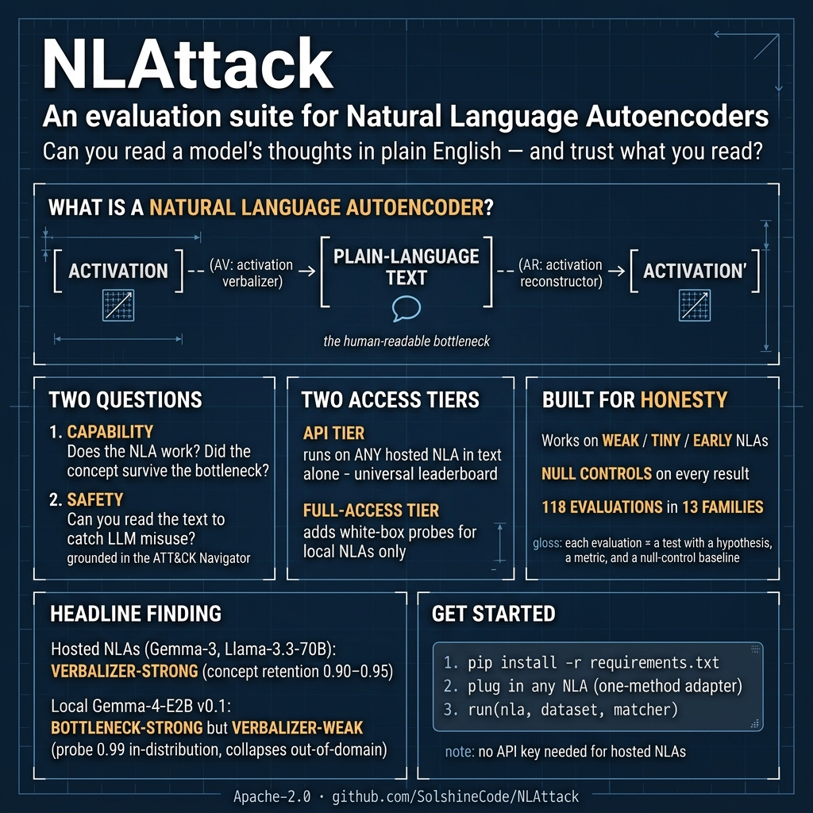
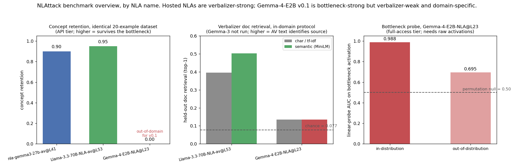

<p align="center">
  
</p>

# NLAttack

**An evaluation suite for Natural Language Autoencoders (NLAs).**


NLAttack measures how well a Natural Language Autoencoder turns a model's internal
activations into human-readable text, and whether that text is good enough to use as
a safety monitor for real-world LLM misuse. It is built to work on weak, small, or
early-training NLAs, scores both the bottleneck and the verbalizer with explicit
null controls, and ships a catalog of 118 evaluations, ready-made adapters for
hosted and local NLAs, and committed result artifacts.

A **Natural Language Autoencoder** explains a model's internal state in plain
language. An activation verbalizer (AV) reads a hidden activation and writes a
description of it. An activation reconstructor (AR) reads that description and
rebuilds the activation:

```
activation --[ AV ]--> natural-language text --[ AR ]--> activation'
```

The human-readable bottleneck is the AV's text. NLAttack asks two questions about
it: does the NLA work at all (capability), and can you catch misuse by reading it
(safety)? See [docs/METHODOLOGY.md](docs/METHODOLOGY.md) for the full background.

## Results



Headline numbers, attributed by NLA name (full tables and caveats in
[docs/RESULTS.md](docs/RESULTS.md)):

| NLA | Access | Concept retention | Doc retrieval (semantic) | Bottleneck probe (in / OOD) |
|---|---|---|---|---|
| `Llama-3.3-70B-NLA-av@L53` | hosted | 0.95 | 0.503 | not available over API |
| `nla-gemma3-27b-av@L41` | hosted | 0.90 | not yet run | not available over API |
| `Gemma-4-E2B-NLA@L23` | local | 0.00 (out-of-domain) | 0.135 (in-domain) | 0.988 / 0.695 |

The hosted NLAs are verbalizer-strong (a reader of their AV text recovers most
concepts). The local Gemma-4-E2B v0.1 is the mirror image: its bottleneck probes
near-perfectly in-distribution, but its verbalizer is weak and domain-specific, so
it collapses on the out-of-domain dataset. Separating those failure modes is the
point of the suite.

## Installation

```bash
git clone https://github.com/SolshineCode/NLAttack.git
cd NLAttack
python -m venv .venv && source .venv/bin/activate   # Windows: .venv\Scripts\activate
pip install -r requirements.txt
```

The core harness has **no required dependencies** (the lexical matcher and the mock
NLA run on the standard library). The extras unlock stronger matching
(`sentence-transformers`, `nltk`), the probe/emergence/deception axes
(`scikit-learn`, `numpy`, `scipy`), and running a local NLA (`torch`,
`transformers`, `safetensors`).

## Quickstart

Run the offline smoke test (a deliberately lossy mock NLA, no network or GPU):

```bash
python run_example.py
```

Plug in any NLA by implementing one method, then evaluate it:

```python
from nla_eval import NeuronpediaNLA, EnsembleMatcher, Example, run

# A dataset is a list of Example(id, text, concepts): the controlled concepts
# present in `text` that we check survived the bottleneck.
my_dataset = [
    Example(id="ex1", text="The committee published its annual budget report",
            concepts=["budget", "report"]),
    Example(id="ex2", text="A storm warning was issued for the coastal region",
            concepts=["storm", "warning"]),
]

nla = NeuronpediaNLA(model_id="llama3.3-70b-it", nla_source_id="kitft-l53")
result = run(nla, my_dataset, matcher=EnsembleMatcher())
```

Discover hosted NLAs with `GET https://www.neuronpedia.org/api/nla/sources`. To
evaluate your own local NLA, implement the one-method `NLA` adapter (see
[docs/EVALUATIONS.md](docs/EVALUATIONS.md)).

## What's inside

- **118 evaluations across 13 families (A-M).** Each evaluation is a designed test
  with a hypothesis, a method, a metric, and a null-control baseline (the catalog
  entries are called "plans"). A subset is implemented as runnable code in the
  harness today, and the rest are documented designs, some awaiting GPU or data. The
  families group them by theme: concept survival, content adjacency and laundering,
  deception, ATT&CK misuse detection, bottleneck probes, faithfulness, distribution
  shift, calibration, and emergence. Index: [plans/INDEX.md](plans/INDEX.md).
- **Two access tiers.** The API tier scores any hosted, text-only NLA (the
  universal leaderboard). The full-access tier adds white-box axes (probes,
  emergence) that need raw activations. Query it in code via `nla_eval.access`.
- **Deception / misalignment monitoring** (Family M): can the NLA's text be read to
  catch a model's own deceptive behavior?
- **Two principles throughout:** floor-first (one reliable per-concept primitive,
  so weak NLAs still yield signal) and null controls on everything (a result counts
  only when it clears a permutation floor).

## Documentation

| Document | Contents |
|---|---|
| [docs/METHODOLOGY.md](docs/METHODOLOGY.md) | What NLAs are, the two purposes, the ATT&CK Navigator background, and the validity limits |
| [docs/EVALUATIONS.md](docs/EVALUATIONS.md) | The 118-plan catalog, the implemented harness modules, the access tiers, and the deception family |
| [docs/RESULTS.md](docs/RESULTS.md) | Reproducible findings, the leaderboard, and the result-attribution convention |
| [DESIGN_REVIEW.md](DESIGN_REVIEW.md) | Validity threats and the rationale for the controls |
| [docs/LITERATURE.md](docs/LITERATURE.md) | The reading list with arXiv ids |

## How to cite

A `CITATION.cff` is included, so GitHub shows a "Cite this repository" button.

```bibtex
@software{deleeuw_nlattack_2026,
  author  = {DeLeeuw, Caleb},
  title   = {{NLAttack}: An Evaluation Suite for Natural Language Autoencoders},
  year    = {2026},
  url      = {https://github.com/SolshineCode/NLAttack},
  note    = {Version 0.1.0}
}
```

A score is meaningful only with the NLA it was measured on. When citing a result,
report the canonical NLA id, the suite commit, the dataset, and the date (see
[docs/RESULTS.md](docs/RESULTS.md)).

## Acknowledgements

NLAs are introduced in Anthropic's Natural Language Autoencoders work
([overview](https://www.anthropic.com/research/natural-language-autoencoders),
[writeup](https://transformer-circuits.pub/2026/nla/)); interactive NLAs are hosted
on [Neuronpedia](https://www.neuronpedia.org/nla). The misuse family is grounded in
Anthropic's [LLM ATT&CK Navigator](https://red.anthropic.com/2026/attack-navigator/)
and the [MITRE ATT&CK](https://attack.mitre.org/) framework.

## License

Apache-2.0. See [LICENSE](LICENSE) and [NOTICE](NOTICE). You may use, modify, and
redistribute it, including commercially, provided you retain the copyright,
attribution, and license notices and state your changes (Section 4). The license
includes an explicit patent grant.

## Contact

Caleb DeLeeuw (`SolshineCode`), caleb.deleeuw@gmail.com.
