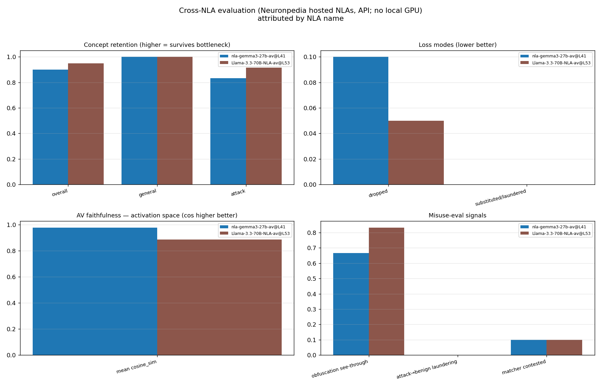
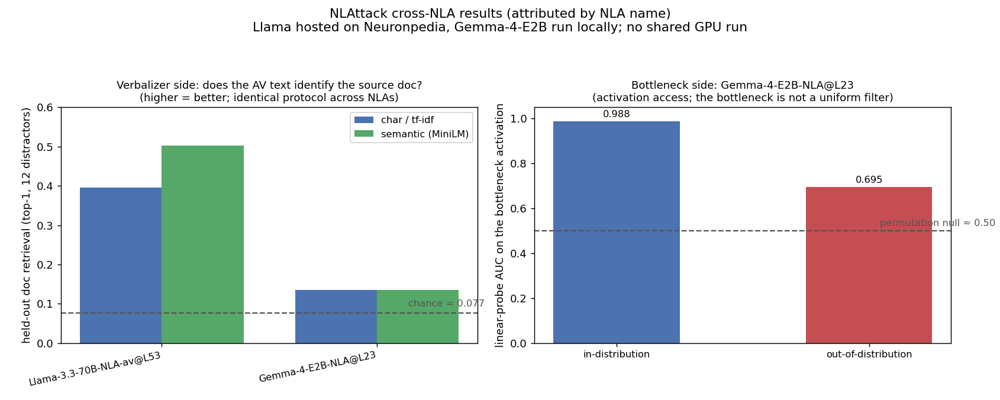

# NLAttack results

Reproducible findings shipped with the suite (`../results/`), the result-
attribution convention, and the benchmark graphs. For concepts see
[METHODOLOGY.md](METHODOLOGY.md); for the eval catalog see
[EVALUATIONS.md](EVALUATIONS.md).

> **Generations.** The findings in this section are the **v1** benchmark and are
> **frozen** — v2 carries them forward unchanged. v2's own additions are in
> [v2 additions](#v2-additions) below. Artifact provenance per generation:
> [`../results/README.md`](../results/README.md).

## Reproducible findings to date (v1, frozen)

These come with the suite (`results/`) and are stated with their caveats. Results
are named by the NLA, not the base model (see the attribution section below).


The one-line read: the two hosted NLAs (Gemma-3, Llama) are verbalizer-strong, so a
reader of their AV text recovers most concepts. The local Gemma-4-E2B v0.1 is the
mirror image, its bottleneck probes near-perfectly in-distribution (0.988 AUC) but
its verbalizer is weak and domain-specific, so it retrieves documents only weakly
in-domain and surfaces nothing on the out-of-domain dataset below. Separating those
two failure modes is the whole point of the suite.

**API tier (the universal leaderboard, any NLA).** Doc retrieval is the headline
column because its null is fixed by the protocol (same documents, 12 distractors so
chance is 0.077, MiniLM embedder), so it is directly comparable across NLAs.

| NLA (by name) | Base model | Access | Doc retrieval char / sem | Concept retention | Obfuscation see-through | Laundering |
|---|---|---|---|---|---|---|
| `Llama-3.3-70B-NLA-av@L53` | llama3.3-70b-it | hosted (API only) | **0.396 / 0.503** | 0.95 | 0.83 | 0.00 |
| `nla-gemma3-27b-av@L41` | gemma-3-27b-it | hosted (API only) | not yet run | 0.90 | 0.67 | 0.00 |
| `Gemma-4-E2B-NLA@L23` | google/gemma-4-E2B | local (full access) | **0.135 / 0.135** (in-domain) | 0.00 (out-of-domain) | n/a | 0.00 |

The two hosted NLAs (Llama and Gemma-3) were run on the **identical 20-example
dataset with the identical matcher**, so their retention, see-through, and
laundering are directly comparable to each other. Doc retrieval is the column that
is also comparable to the local Gemma-4 NLA, because its null is fixed by the
protocol (12 distractors, chance 0.077). Gemma-3 doc retrieval is not yet run.

The Gemma-4-E2B v0.1 row carries an **out-of-domain caveat**. It is a tiny,
domain-specific NLA trained on a 4 GB consumer GPU; its model card states the
verbalizer is at chance out-of-domain and only modestly above chance in-domain. The
cross_nla dataset (general + attack sentences) is out-of-domain for it, so on the
identical 20 examples its verbalizer emits generic hallucinations or empty strings
(14 of 20 non-empty, none surfacing the input concept), giving 0.00 retention. That
is verbalizer collapse on unfamiliar text, not a like-for-like capability gap with
the general-purpose hosted NLAs. Its **fair, in-domain** numbers are the doc
retrieval (0.135, weakly above chance) and the bottleneck probe (0.988 in-dist)
below. The eval used the published v0.1 AV
([`Solshine/gemma-4-e2b-nla-L23-av-v0_0_1`](https://huggingface.co/Solshine/gemma-4-e2b-nla-L23-av-v0_0_1)).



Gemma-3 and Llama trade off against each other. Gemma-3 reconstructs much more
faithfully (cosine 0.979 versus 0.887, mse 0.043 versus 0.225) but retains slightly
fewer concepts (0.90 versus 0.95) and is easier to fool with obfuscated attack text
(see-through 0.67 versus 0.83). Neither launders attack terms into benign neighbors.
Activation-space cosine is reported per-NLA rather than ranked, because it is not on
a common scale across different base models.

**Full-access tier (white-box, local NLAs only).** Needs the raw activation, so it
cannot be scored on the hosted NLAs above.

| NLA (by name) | Bottleneck probe AUC, in-dist / OOD |
|---|---|
| `Gemma-4-E2B-NLA@L23` | 0.988 / 0.695 |



These two sides tell different stories. The Llama NLA is verbalizer-strong: its AV
text identifies the held-out source document well above chance. The Gemma-4-E2B NLA
is the opposite, bottleneck-strong but verbalizer-weak: a linear probe reads
in-distribution concepts off its activation at 0.988 AUC, yet its verbalization
retrieves documents at 0.135 (chance 0.077, p = 0.08, not significant), so it sits
at the conditioning wall. That gap is exactly what NLAttack is built to separate.

The detail bullets, with caveats:

- **Cross-NLA, hosted (no GPU).** On one fixed 20-example dataset and matcher, the
  **Llama-3.3-70B** NLA (`kitft-l53`) reaches concept retention 0.95, AV
  faithfulness cosine 0.887 (mse 0.225), and obfuscation see-through 0.83; the
  **Gemma-3-27B** NLA (`kitft-l41`) reaches retention 0.90, a much higher cosine
  0.979 (mse 0.043), and see-through 0.67. Both show zero attack-to-benign
  laundering. Llama held-out doc retrieval (12 distractors, chance 0.077, MiniLM):
  char 0.396, semantic 0.503; Gemma-3 doc retrieval not yet run.
- **Local Gemma-4-E2B NLA.** The bottleneck encodes in-distribution concepts at
  about 0.99 probe AUC and out-of-distribution concepts at about 0.70, so the
  bottleneck is not a uniform filter. The verbalizer is the weak side: held-out
  doc retrieval is about 0.135 (chance 0.077, not significant), placing it at the
  conditioning wall. Same metric, the Llama NLA is roughly 3.7x higher.
- **Deception probe on real behavioral-split data.** On honest-vs-deceptive
  activations from prior work (nanochat-d32, layer 12, n=1327), the deception
  probe reaches AUROC 0.932 / balanced accuracy 0.866 versus a shuffled-label
  floor of 0.49, reproducing that line of work's roughly 0.87 baseline through
  NLAttack's own permutation-controlled probe.

Numbers from the hosted API can change under a fixed source id (the backend is
redeployed), which is exactly why results are attributed and dated.


## v2 additions

Additive to the frozen v1 results above; nothing here changes a v1 number.

**CTF Red/Blue (Family N), control-tier demo.** The offline mechanics demo
(`results/ctf/ctf_red_blue_mock.json`, reproduced by
`python experiments/ctf_red_blue_demo.py`) plays an adaptive laundering Red team
against a Blue monitor built on the deliberately weak `MockNLA`. Against a naive
(plain-statement) Red, the monitor busts only a fraction of attempts — the lossy
bottleneck has already dropped most tells; against the adaptive Red, the catch rate
falls to ~0 within a couple of queries while the clean-capture rate goes to ~1.

This is a **control-tier** result by the integrity gate (P128): the capture oracle
is the model-agnostic survival proxy over **constructed** flags, so it demonstrates
the game mechanics and the verbalizer blind spot, **not** a monitor certification. A
**primary-tier** result — the number a deployer should weigh — requires a real
bottleneck-probe oracle over the model's own honest-vs-deceptive behavior
(`ctf.probe_capture_oracle`), gated on a local NLA + GPU. The exact rates from the
weak `MockNLA` are illustrative and should not be read as a monitor score.

**Domain-aware contrastive Gemma-4-E2B verbalizer (honest negative).** The
domain-aware-contrastive AV variant
(`results/local_gemma_e2b/domainaware_nla_verbalizer_axes.json`) improves
likelihood-based domain routing, but its *generation*-based minimal-pair AUC stays
at chance (0.491 vs a 0.531 v1 baseline): the verbalizer routes domain without its
generations carrying distinguishing within-domain content. Reported as a negative,
per the suite's null-control discipline.


## Result attribution: name results by the NLA, not the base model

A base model can host many different NLAs (different AV/AR checkpoints, layers,
and training runs). `gemma-3-27b-it` is a *model*; `kitft/nla-gemma3-27b-av` at
layer 41 is an *NLA*, and two NLAs on the same base model can score very
differently. **Every result in this suite is attributed to the NLA.**

Canonical NLA id (record it with every result):

```
<av_checkpoint>__<base_model>__L<layer>__<source_id>
# hosted example:  kitft/nla-gemma3-27b-av__gemma-3-27b-it__L41__kitft-l41
# local example:   av_v0_1__google/gemma-4-E2B__L23
```

Short label for plots and tables: `<av_basename>@L<layer>`, e.g.
`nla-gemma3-27b-av@L41`. When you publish a number, record the NLA id, the base
model, the layer, the AV and AR checkpoints, the eval suite version (a commit
hash), the dataset, the matcher backend, and the date. `nla_name()` in
`experiments/cross_nla_eval.py` builds these fields automatically.

